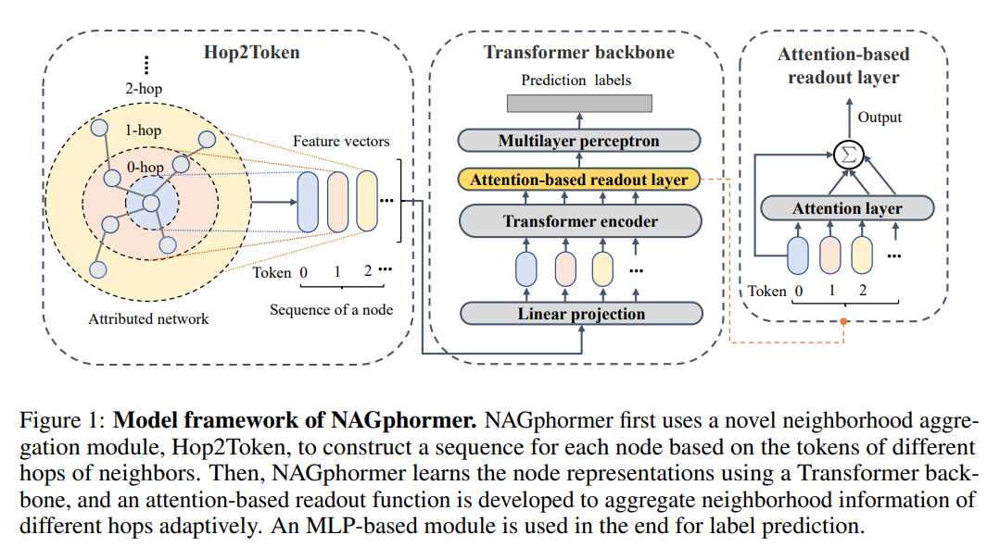

# NAGphormer
This is the code for our ICLR 2023 paper 
**NAGphormer: A Tokenized Graph Transformer for Node Classification in Large Graphs**.



## Requirements
Python == 3.8

Pytorch == 1.11

dgl == 0.9

CUDA == 10.2


## Usage

You can run each command in "commands.txt".

You could change the hyper-parameters of NAGphormer if necessary.

Due to the space limitation, we only provide several small datasets in the "dataset" folder.

For small-scale datasets, you can download them from https://docs.dgl.ai/tutorials/blitz/index.html.

For large-scale datasets, you can download them from https://github.com/wzfhaha/GRAND-plus.


## Cite
If you find this code useful, please consider citing the original work by authors:
```
@inproceedings{chennagphormer,
  title={NAGphormer: A Tokenized Graph Transformer for Node Classification in Large Graphs},
  author={Chen, Jinsong and Gao, Kaiyuan and Li, Gaichao and He, Kun},
  booktitle={Proceedings of the International Conference on Learning Representations},
  year={2023}
}
```
